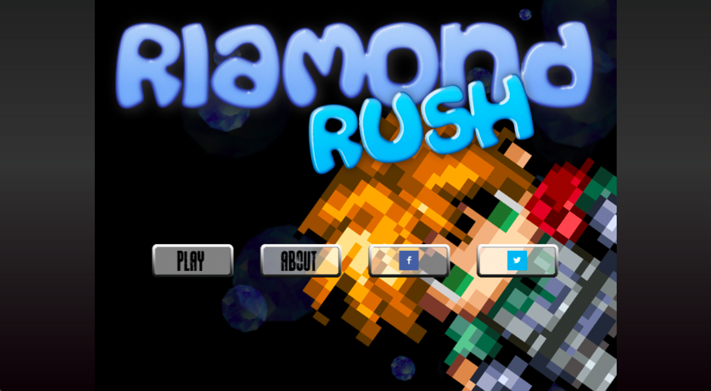
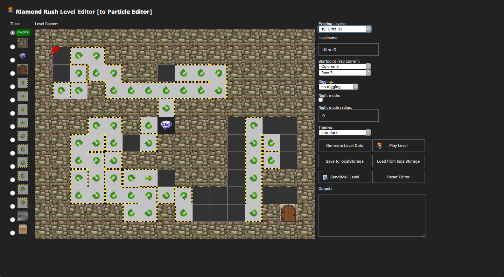
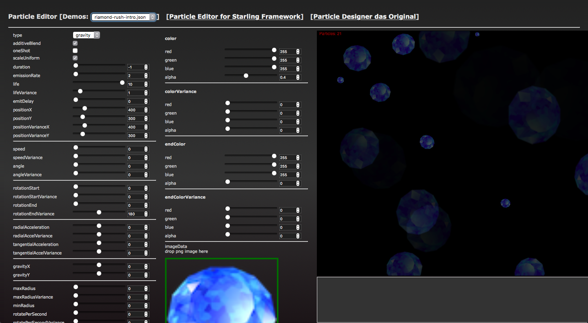

# Riamond Rush

Riamond Rush was a little game project some time ago written in plain vanilla javascript using the canvas element and for some targets using CocoonJS. This game finally found his way into the Apple AppStore, Google Playstore, to Ouya game console and some HTML5 game portals.
For the mobile stores CocoonJS was used to get project files for the specific targets to compile.



To make level design easier i wrote a simple level editor for the game. Nothing special or fancy stuff, just HTML and JS.



For some little particle animated effects i wrote a particle editor. The javascript code for the particle animation i ported from another framework but i dont remember these days which it was.



## Play Riamond Rush using PHP builtin webserver
If you have installed PHP. Use console change to the Riamond Rush project directory and execute the following command:
```
php -S localhost:8080
```

After that you can play the game with http://localhost:8080, use the level editor http://localhost:8080/editor.html or use the particle editor with http://localhost:8080/particleeditor.html
Choose the browser you want, but i will suggest you to use Google Chrome.

## Play Riamond Rush using LAMP stack

If you have a installed (L/W/M)AMP i think there is nothing to say ;-)

## Play Riamond Rush using tweaked browser

Some time ago the Safari development tool had a option to allow it to open local files and handle them like opened from a server. I haven't looked if other browsers have a similar feature but i think there is a way ^d^

## Some videos of Riamond Rush

Riamond Rush gameplay

[](https://www.youtube.com/watch?v=DCGrNzqN78M)

Riamond Rush on Ouya

[](https://www.youtube.com/watch?v=YTEdCJPEG8o)

Riamond Rush on iPad

[](https://www.youtube.com/watch?v=uBxemqIBkJc)
